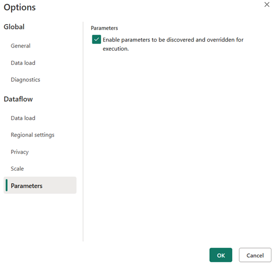
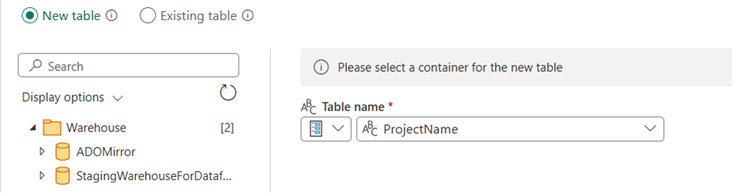

# Azure DevOps Reporting using Microsoft Fabric
Azure DevOps provides analytics views and ODATA support for building advanced queries.  These are powerful capabilities, but often lend to challenges with resource consumption for large scale organizations when reports are significantly large or complex.  It's not uncommon to run into throttling limitations by the ADO analytics service, Power BI Service, or limitations of the Power BI client when building queries on a desktop.  It can also be hard to determine exactly when/where a limit is being hit.  Simply put, if you are doing large scale reporting with ADO, it can be a journey to navigate these types of issues.

Similarly, ADO provides a rich set of APIs to get just about any kind of data you need - but these are also subject to throttling limitations. Simply put, they are great for many integration scenarios but not ideal for querying large amounts of data you might need for more complex reporting purposes.
 
Microsoft Fabric provides a robust environment where you have better control over the compute used to perform these types of reporting tasks.  It also provides a rich set of tools of ingest data from various sources, build reports, and orchestrate the automation needed to refresh data sets.  
 
As of today (July 2025), while there is still a little bit of work involved to get ADO data into Fabric, it's a much more capable platform for ADO reporting needs.  You may still need to fine tune queries and date ranges to avoid throttling by the ADO analytics service during ingestion, but you have much more control of the compute in Fabric once it's in there.
 
The approach below is intended as a help jump start this journey with Fabric.  It uses ODATA queries against Azure DevOps Analytics Service.  For the purpose of this sample, the queries used are very basic, but you could easily expand those for more complex use cases.  This also assumes you have some basic fundementals with Microsoft Fabric (creating pipelines and data flows).
 
There are a few "gotchas".  

While Fabric provides some capabilities for incremenetal refresh, it depends on data sources that support it the requirements.  As of now, the ODATA implementation with ADO isn't one of them, but you can incorporate dates into your Analytics queries and build some simple logic to effectively keep your queries small and implement a refresh that only grabs deltas. 
The other thing you will run into is that you may need to do some data conversion between ADO's ODATA results and what you can push into Fabric Warehouse. For instance, Date/Time/Zome will need to be converted to Date/Time. For more info, details, check out https://learn.microsoft.com/en-us/fabric/data-factory/dataflow-gen2-data-destinations-and-managed-settings#supported-data-source-types-per-destination
 
This approach uses a pipeline+dataflow to build a tracking table of ADO projects and store a LastModified data (when it was last imported).  It uses a second pipeline+dataflow to enumerate the tracking table and run an import of each ADO project to pull the latest workitems into Fabric. 

Before you start down this road, it's a good idea to spend some time exploring the Azure DevOps Analytics and ODATA implementation - along with query guidelines to get more familiar with the model.
##References:

**What is Analytics?**
https://learn.microsoft.com/en-us/azure/devops/report/powerbi/what-is-analytics?view=azure-devops

**OData Analytics query guidelines for Azure DevOps**
https://learn.microsoft.com/en-us/azure/devops/report/extend-analytics/odata-query-guidelines?view=azure-devops

**Performance and latency of Analytics**
https://learn.microsoft.com/en-us/azure/devops/report/powerbi/performance-latency?view=azure-devops 

Let's get started…
 
# Create the new Warehouse
Starting with a new Fabric Workspace, create a Warehouse where you will store your data.  You'll use this new warehouse as a destination in the following steps.  You may find it help to copy the SQL connection string for this warehouse and open it in SQL Management studio as you work through setup so you can inspect table and activity to see how it works.
 
# Preparing the Project Tracking Table
I chose to use a ProjectTacking table to manage a list of ADO projects and track a LastModifed date which indicates when the data was last imported (e.g. - sync's up to this date).
 
There are two artifacts used to set this up -- a pipeline to create the Table (PrepareProjects.zip) and a simple dataflow to pull all the ADO projects from ODATA to populate it (PopulateProjectsTableFromADO.pqt).  Both have been exported as templates to make it easy to import into a new environment.
 
Create a new data Pipeline in your environment Call it PrepareProjects.  
Once the pipeline editor open, choose Import from the menu and point it to the PrepareProjects.zip file.
The import process will ask you to re-map the input to your Warehouse, so point it to the new warehouse you created for this purpose and select "Use This Template".

 
Run the pipeline.  The first step should succeed and create the ProjectTracking table in the warehouse.  The second will fail until we set that up in the next step.
 
Open the "PrepareProjects" pipeline, edit "Setup Tracking Table" and set the connection to your new warehouse.  
Edit the "Populate Projects from ADO" step and map to your workspace and make sure it's set to run PopulateProjectsTableFromADO data flow.
Set Organization param in the dataflow to the name of your org
Run the Pipeline
 
Setup Tracking table should succeed, but the dataflow call will fail the first time.  We need to authorize the connect and map the warehouse settings in the dependent dataflow.
 
Now, create a new Dataflow Gen 2.  Call is PopulateProjectsTableFromADO.  You should see a checkbox to enable Git Integration as you provide the name.  Make sure to enable Git integration so this is created with the newer capabilities to pass parameters from pipelines to the dataflows.

When the editor opens, choose "Import from a Power Query Template" and import the PopulateProjectsTableFromADO.pqt file.
 
You can configure the Organization param here for your org (this is typically passed as a param from the pipeline).  Run the query to make sure it's retrieving project data from ADO (you will need to configured the connection the first time you run it).  
 
Edit Options in the data flow to enable parameters to be overridden for execution.

 
Now, add a data destination and map to your new warehouse, choose Existing Table and assign to the ProjectTracking table created in the initial pipeline.
Choose Replace as the Update method and keep the other defaults.  Save Settings.
Save the Data Flow.
 
Go back to the PrepareProjects pipeline and update the settings in "Populate Projects from ADO" step to point to the dataflow you just imported using the current workspace.
Add a "Organization" parameter to pass to the dataflow with the name of your ADO org.  (If you don't see the option to add parameters, you make sure you are using a dataflow with Git support and you enabled params to be overridden in the previous step).
 
 
Run the PrepareProjects Pipeline again and it should fully succeed now.  You can re-run that pipeline anytime you need to refresh the project list.  You can explore the ProjectTracking table and see that all the projects are there.

 
## Summary of what this is actually doing:
Creates a ProjectTracking Table in your Warehouse with the name, SK, and LastModified date of each project.  Organization is a variable in your dataflow and passed in by the pipeline.  You'll need to configure a connection anytime that organization changes, but it will use the saved connection once you do that.
I do this as an easy way to reference all the projects I want to work with as a table in the warehouse so I don't have to query ADO each time.  It also serves as a placeholder to record the last sync date for each project, so we can query for changes between runs (vs. trying to pull everything each time).  
 
 
# Seeding and Refreshing WorkItem data
The process for getting ADO workitem data into the warehouse also uses two artifacts.  A pipeline to orchestrate the import of data for each project (SeeAndUpdateProjectsFromADO.zip) and dataflow to actually run the project specific ODATA query and populate the related warehouse table (SeedWorkitemsByProject.pqt).
 
Create a new Dataflow Gen2 and call it SeedWorkitemsByProject.  You should see a checkbox to enable Git Integration as you provide the name.  Make sure to enable Git integration so this is created with the newer capabilities to pass parameters from pipelines to the dataflows.
 
Once the editor opens, choose "Import from a Power Query template" and import SeedWorkItemsByProject.pqt.
 
It's a good idea to check the query to make sure you are getting some data back.  The query relies on the parameters ProjectName, ProjectSK, and Organization.  You can set these to a known, good value out of your ProjectTracking table for a project to make sure you are getting data back.  You should have already configured the connection in the previous steps (it will ask you to configure a new connection if you are querying a new ADO organization for the first time).
You'll also notice there is a ImportStartDate and an ImportStopDate which are used by the calling pipeline to control how much data we try to pull in per run. You can ignore these for now.
 
Edit Options in the data flow to enable parameters to be overridden for execution.
 
Add a data destination for your new warehouse-- select your new warehouse, choose New Table, and change the Table Name option to use a parameter from your query (ProjectName). This is a variable in the dataflow (which is also passed in by the pipeline that will end up calling it).

Choose Next.
Change the update Method to "Append" (we're not recreating the table every time, just adding new rows).  You can accept defaults for everything else.
*In this example, I'm using a very simple ODATA query and pulling minimal fields.  If you expand this with more data, you may have convert of map types that the warehouse supports.  Similarly, if the schema changes you may have to clean out the existing tables and re-create them.  This example if for proof of concept purposes, so I'm keeping it as simple as possible.
Save Settings, Save the Data Flow.
 
Now we configure the pipeline that enumerate the projects and call this dataflow for each and every project.
 
Create a new data pieline.  Call is SeedAndUpdateProjectsFromADO.
Once the editor opens, choose Import and import the SeedAndUpdateProjectsFromADO.zip template.
If will ask you to map inputs to your Warehouse, as it imports, so choose your current warehouse and "Use this template".
 
The pipeline supports an ImportStartDate and an ImportStopDate variable.  If you do not supply these, it will try to pull in everything.  If you run into issues with ADO throttling, you can adjust these date to pull in a period of time (a year, several months, etc.).  These dates help control how many workitems end up coming back with each run.  With each run, the ProjectTracking table is updated with the ImportStopDate.
 
Edit EnumerateProjects and update the connection for your new data warehouse and point it to the ProjectTracking table you created in the previous step)
Edit the GetProjectData step inside the ForEach (RunDataflowForEachProject)
Map it to your current workspace and make sure it calls SeedWorkItemsByProject data flow.  Update these variables (sorry, these get reset when you change the workspace or use a template)

 
Finally, make sure the RemoveDuplicates and UpdateProjectTracking steps and update the connection to your new warehouse.
Validate to make sure everything looks good - Save and Run.
 
## Summary of what this is doing:
This pipeline uses the ProjectTracking table we setup earlier and enumerates every project in that table, effectively calling the ForEach (RunDataflowForEachProject) on every project.
The ForEach derives a start and stop date by looking at whether you set these pipeline variables, and if not - will try to set the start date based on the last time it was run (looking at the LastModifed data in the ProjectTacking table) and using the current date as the new stop date.
It calls the SeedWorkItemsByProject dataflow with these params, so that is executing a project level ODATA query to get new worktimes (based on the ADO AnalyticsUpdatedDate) and saves those off into the warehouse in the project related table.
This ingestion process will create duplicates for workitems that were previously imported, so as a last step, it issues a TSQL command to remove duplicates (keeping the workitem with the most recent AnalyticsUpdatedDate).

